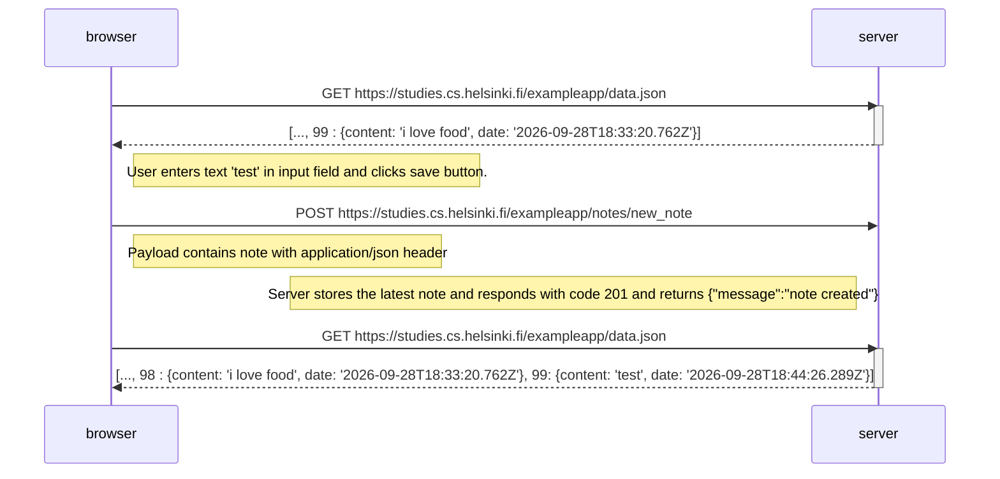

```mermaid
sequenceDiagram
    participant browser
    participant server
    
    browser->>server: GET https://studies.cs.helsinki.fi/exampleapp/data.json
    activate server
    server-->>browser: [..., 99 : {content: 'i love food', date: '2026-09-28T18:33:20.762Z'}]
    deactivate server

    Note right of browser: User enters text 'test' in input field and clicks save button.
    browser->>server: POST https://studies.cs.helsinki.fi/exampleapp/notes/new_note
    Note right of browser: Payload contains note with application/json header
    Note left of server: Server stores the latest note and responds with code 201 and returns {"message":"note created"}

    browser->>server: GET https://studies.cs.helsinki.fi/exampleapp/data.json
    activate server
    server-->>browser: [..., 98 : {content: 'i love food', date: '2026-09-28T18:33:20.762Z'}, 99: {content: 'test', date: '2026-09-28T18:44:26.289Z'}]
    deactivate server
```